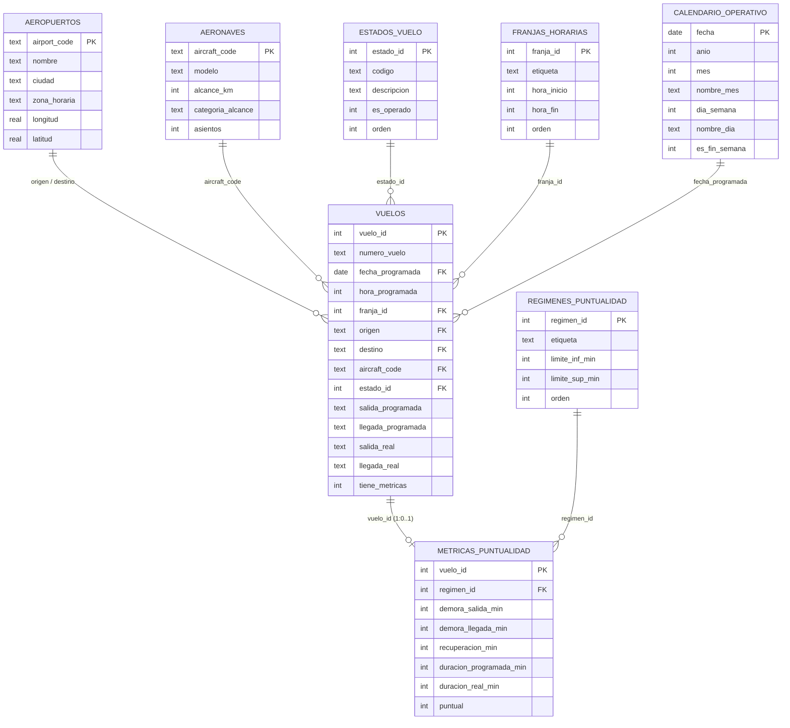

# Modelado de datos

Documentación del diseño de la base de datos de la investigación **"Puntualidad y
regularidad operativa de vuelos domésticos, julio-septiembre de 2017"**.

---

## 1. Punto de partida: la fuente cruda

La base descargada de Kaggle (`travel.sqlite`, 109 MB) es la exportación a SQLite de
`demo`, la base de demostración que PostgreSQL distribuye con fines didácticos. Contiene
ocho tablas:

| Tabla | Filas | Contenido |
|---|---:|---|
| `flights` | 33.121 | **Tabla de interés para esta investigación**: programación y horarios reales |
| `ticket_flights` | 1.045.726 | Cupones vendidos |
| `boarding_passes` | 579.686 | Pases de embarque |
| `tickets` | 366.733 | Billetes |
| `bookings` | 262.788 | Reservas |
| `seats` | 1.339 | Un asiento por fila |
| `airports_data` | 104 | Aeropuertos |
| `aircrafts_data` | 9 | Modelos de aeronave |

Esta investigación usa `flights` como tabla de hechos y `airports_data`, `aircrafts_data`
y `seats` como catálogos. Las cuatro tablas comerciales quedan fuera de su alcance.

### 1.1. Problemas estructurales de la fuente

Cuatro rasgos heredados de PostgreSQL impiden usar el dato tal cual. Los tres primeros
son visibles; **el cuarto es silencioso y por eso el más peligroso**.

| Problema | Cómo llega | Consecuencia si no se depura |
|---|---|---|
| **Campos JSON** | `{"en": "Yakutsk Airport", "ru": "Якутск"}` | Ningún motor puede agrupar por un documento JSON. |
| **Coordenadas como texto** | `(129.77099609375,62.0932998657226562)` | Es el tipo `point`, en orden **longitud-latitud**, el inverso del cartográfico. Invertirlos sitúa los aeropuertos rusos en el océano Índico. |
| **Desplazamiento horario pegado** | `2017-07-16 01:50:00+03` | Impide comparar sellos directamente. |
| **Nulos disfrazados** | La cadena literal `\N` en `actual_departure` y `actual_arrival` | `julianday('\N')` devuelve **nulo en silencio**: el cálculo no falla, la demora simplemente sale vacía y nada avisa del error. |

---

## 2. Modelo lógico: esquema en estrella en 3FN

Esquema en estrella normalizado hasta la **Tercera Forma Normal**, con seis dimensiones
y dos tablas de hechos en relación **1:0..1**.



### 2.1. Inventario de tablas

| Tabla | Tipo | Filas | Función en el modelo |
|---|---|---:|---|
| `vuelos` | Hechos | 33.121 | Programación completa. **Universo de programación** |
| `metricas_puntualidad` | Hechos | 16.773 | Medidas calculadas. **Universo de operación** |
| `aeropuertos` | Dimensión | 104 | Nombre, ciudad, huso y coordenadas depuradas |
| `aeronaves` | Dimensión | 9 | Modelo, alcance, capacidad y categoría |
| `calendario_operativo` | Dimensión | 61 | Fecha, día de la semana, fin de semana |
| `estados_vuelo` | Dimensión | 6 | Estado del vuelo y bandera de operado |
| `regimenes_puntualidad` | Dimensión | 5 | **Variable segmentadora del estudio** |
| `franjas_horarias` | Dimensión | 5 | Bloques operativos de la jornada |

---

## 3. Decisiones de diseño y su justificación

### 3.1. La relación 1:0..1 — la decisión más consecuente

Un diseño convencional habría descartado desde el inicio los vuelos sin hora real de
salida, quedándose con los 16.773 útiles.

**Este modelo no lo hace.** Carga los 33.121 vuelos en `vuelos`, marca cada uno con la
bandera `tiene_metricas` y genera fila en `metricas_puntualidad` sólo para los operados.
La relación entre las dos tablas de hechos es por tanto **1:0..1**, no 1:1.

La consecuencia es que **el hecho de que sólo el 50,64 % de la programación se ejecutara
se vuelve medible en lugar de invisible**, y el aplicativo puede advertirlo en su primera
pantalla antes de mostrar cualquier demora.

### 3.2. Las dimensiones construidas por la investigación

Tres de las seis dimensiones **no existen en la fuente**; son categorías elaboradas por
el equipo y se declaran como tales:

| Dimensión | Criterio | Por qué no es arbitrario |
|---|---|---|
| `regimenes_puntualidad` | Cinco tramos de demora | Los límites se fijaron sobre la **distribución empírica observada**, que resultó ser bimodal. Se incorpora el umbral de 15 minutos, estándar del sector para el indicador de puntualidad. |
| `franjas_horarias` | Cinco bloques de la jornada | Se usan bloques y no las 24 horas sueltas: el interés es describir el patrón de la jornada, y 24 categorías lo fragmentarían sin añadir información. |
| `aeronaves.categoria_alcance` | Regional / Corto y medio / Largo | Permite comparar la puntualidad entre bloques homogéneos: un turbohélice regional y un Boeing 777 no operan en el mismo régimen. |

### 3.3. Medidas construidas, no observadas

**Ninguna medida de puntualidad existe en la fuente.** Sólo hay cuatro sellos de tiempo;
todo lo demás se calcula en el ETL:

| Medida | Cálculo | Justificación |
|---|---|---|
| `demora_salida_min` | `(julianday(real) − julianday(programada)) × 1440` | `julianday` devuelve días decimales; el factor los convierte a minutos. |
| `demora_llegada_min` | Ídem sobre los sellos de llegada | Nula si no consta la llegada (16.406 registros de la fuente). |
| `recuperacion_min` | `demora_salida − demora_llegada` | **Positiva si el vuelo recortó tiempo en ruta.** Es la medida que permite contrastar la práctica del *schedule padding*. |
| `duracion_programada_min` | Diferencia entre los dos sellos programados | Tiempo de bloque. |
| `duracion_real_min` | Diferencia entre los dos sellos reales | Nula si no consta la llegada. |
| `puntual` | `1` si la demora de salida ≤ 15 min | Criterio estándar del sector (OTP). Como bandera entera es más rápida que una comparación. |

### 3.4. Llave natural conservada

A diferencia de otros modelos de esta serie, aquí **no se introduce una llave subrogada**:
`vuelo_id` es directamente el `flight_id` de la fuente. El motivo es que ese
identificador ya es estable, único y no depende de decisiones de numeración del ETL, de
modo que añadir una llave propia sólo habría añadido una indirección sin ganancia.

---

## 4. Del modelo relacional al Data Lake analítico

### 4.1. Por qué no consultar SQLite directamente

La base de origen fue diseñada para un perfil **OLTP**: muchas operaciones pequeñas
sobre filas completas, que es justamente lo que hace un sistema de reservas. Esta
investigación tiene un perfil **OLAP**: pocas consultas que leen pocas columnas de
muchas filas y las agregan.

### 4.2. Resultados medidos de la conversión

| Etapa | Volumen |
|---|---:|
| Base cruda de Kaggle (`travel.sqlite`) | 109,53 MB |
| Base normalizada SQLite (`puntualidad_vuelos_2017.db`) | 6,46 MB |
| **Data Lake Parquet (carpeta `data/`)** | **0,59 MB** |

Compresión respecto de la base normalizada: **11,0×**. Detalle por archivo:

| Archivo Parquet | Filas | Tamaño |
|---|---:|---:|
| `vuelos.parquet` | 33.121 | 0,46 MB |
| `metricas_puntualidad.parquet` | 16.773 | 0,10 MB |
| `aeropuertos.parquet` | 104 | 0,01 MB |
| `aeronaves.parquet` | 9 | < 0,01 MB |
| `calendario_operativo.parquet` | 61 | < 0,01 MB |
| `estados_vuelo.parquet` | 6 | < 0,01 MB |
| `regimenes_puntualidad.parquet` | 5 | < 0,01 MB |
| `franjas_horarias.parquet` | 5 | < 0,01 MB |

El Data Lake completo cabe holgadamente en el repositorio, de modo que **el aplicativo es
autocontenido**: quien lo clone puede ejecutarlo sin descargar la base original.

---

## 5. Transformaciones aplicadas en el ETL

| Código | Transformación | Detalle |
|---|---|---|
| **T1** | Depuración de nulos disfrazados | Las horas reales con el valor `\N` se convierten a NULL. **Sin este paso el cálculo no falla: devuelve nulo en silencio.** |
| **T2** | Normalización de sellos de tiempo | Se recorta a los 19 primeros caracteres. Correcto porque **todos** los sellos comparten el desplazamiento `+03`, extremo verificado antes de decidirlo. |
| **T3** | Cálculo de las demoras | Diferencia en minutos mediante `julianday`. |
| **T4** | Recuperación en ruta | Demora de salida menos demora de llegada. |
| **T5** | Asignación del régimen | Según los cortes del catálogo, de modo que la clasificación del ETL y la del catálogo no puedan divergir. |
| **T6** | Relación 1:0..1 | Sólo los vuelos con salida real generan métricas. |
| **T7** | Extracción de campos JSON | Nombre de aeropuerto, ciudad y modelo, clave `"en"`. |
| **T8** | Descomposición de coordenadas | Cadena `point` → longitud y latitud numéricas, **en ese orden**. |

### 5.1. Controles de integridad ejecutados

Al cerrar la carga, `03_procesamiento_carga.py` ejecuta diez verificaciones. Resultado de
la ejecución de referencia:

| Control | Esperado | Obtenido |
|---|---|---:|
| Vuelos cargados | 33.121 | 33.121 |
| Métricas de puntualidad | 16.773 | 16.773 |
| Vuelos marcados con métricas | 16.773 | 16.773 |
| Vuelos sin aeropuerto de origen válido | 0 | 0 |
| Vuelos sin aeropuerto de destino válido | 0 | 0 |
| Vuelos sin aeronave válida | 0 | 0 |
| Vuelos sin fecha en el calendario | 0 | 0 |
| Métricas huérfanas | 0 | 0 |
| Incoherencias bandera/métricas | 0 | 0 |
| Demoras de salida negativas | 0 | 0 |

---

## 6. Anomalía de la fuente detectada y declarada

**Ocho vuelos marcados como `Cancelled` tienen hora real de salida y de llegada.** No
pueden estar cancelados si despegaron y aterrizaron.

El ETL **los conserva tal cual** y el aplicativo declara la inconsistencia en su primera
pantalla. La alternativa —reclasificarlos en silencio— habría ocultado al lector un
problema de calidad del dato que debe conocer para interpretar las cifras de
cancelación.

---

## 7. Reproducción del modelo

```bash
cd "Base de datos"
python 01_creacion_esquema.py       # Esquema en estrella + índices
python 02_poblacion_catalogos.py    # Catálogos construidos y depurados de la fuente
python 03_procesamiento_carga.py    # ETL + verificación de integridad
python 04_exportacion_parquet.py    # Genera el Data Lake en ../data/
```

Los scripts 02 y 03 esperan la base cruda en `../../travel.sqlite`. Para indicar otra
ubicación:

```bash
TRAVEL_DB_PATH=/ruta/a/travel.sqlite python 03_procesamiento_carga.py
```

Tiempo total de referencia del proceso completo: **menos de cinco segundos**.
