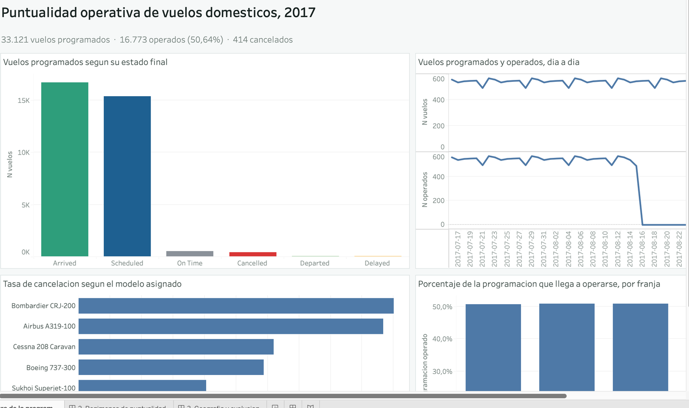
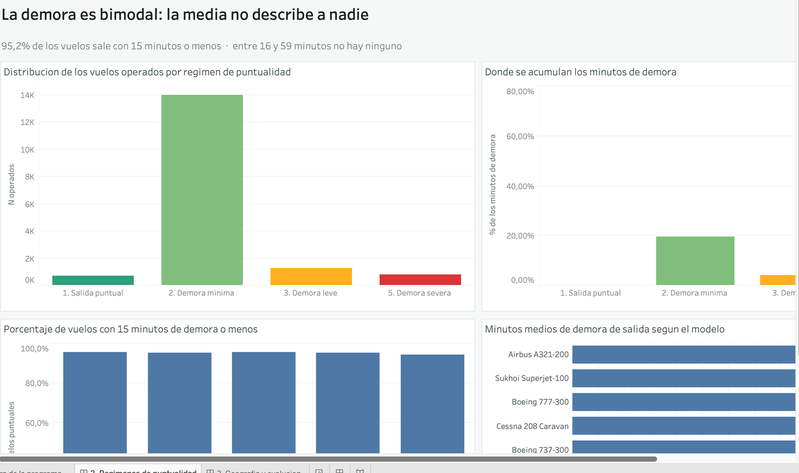
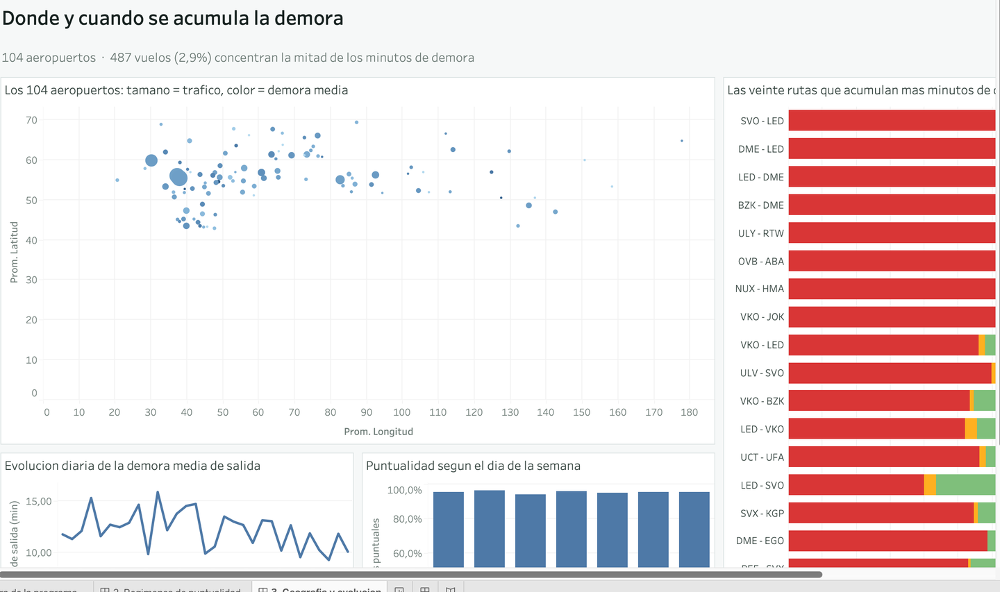

# Tablero de Tableau — Puntualidad operativa de vuelos domésticos, 2017

### 📊 Ver el tablero en línea: **[Tableau Public](https://public.tableau.com/app/profile/oliver.triveno/viz/Puntualidad_Operativa_Vuelos_2017/1_Coberturadelaprogramacion)**

Tablero ejecutivo que acompaña al aplicativo de Streamlit. Tres páginas, doce
hojas, construidas **enteramente por código** a partir del Data Lake del
proyecto.



---

## Contenido de la carpeta

```
Tableau/
├── generar_extractos.py                    Data Lake  →  CSV agregados
├── construir_hyper.py                      CSV        →  extracción .hyper
├── construir_libro.py                      extracción →  libro .twb
├── empaquetar.py                           libro      →  paquete .twbx
│
├── Puntualidad_Operativa_Vuelos_2017.twb   Libro generado
├── Puntualidad_Operativa_Vuelos_2017.twbx  Paquete publicable
├── puntualidad_2017.hyper                  Extracción de datos
│
├── extractos/                              Los cuatro CSV de origen
├── calculos/campos-calculados.md           Fórmulas y su justificación
├── preparacion/transformacion-datos.md     Registro de transformaciones
└── capturas/                               Las tres páginas del tablero
```

---

## Por qué el libro se genera por código

Un `.twb` es un archivo XML. Construirlo con un script en lugar de arrastrar
campos en la interfaz tiene tres consecuencias prácticas:

1. **Es reproducible.** Si cambian los datos, cuatro órdenes reconstruyen el
   tablero entero. No hay ningún paso manual que recordar.
2. **Es auditable.** Cada decisión —qué campo va en qué estante, qué fórmula usa
   cada cálculo, qué color corresponde a cada régimen— está escrita en el código
   y versionada, no enterrada en un archivo binario.
3. **No puede divergir del aplicativo.** Los extractos salen del mismo Data Lake
   que consume Streamlit, y un control de consistencia verifica que los totales
   coincidan exactamente.

### Reglas del formato que costó descubrir

El validador de Tableau es estricto y **su mensaje de error queda enmascarado en
el log** (`error-details=["*****"]`); sólo el diálogo de la aplicación lo muestra
entero. Las reglas que hubo que respetar están documentadas en la cabecera de
`construir_libro.py`. Las tres menos evidentes:

* Cada `<worksheet>`, `<dashboard>` y `<window>` necesita su `<simple-id>`, y va
  **siempre al final** del elemento.
* Dentro de `<datasource>`, **todos** los `<column>` van antes que **todos** los
  `<column-instance>`. Declararlos por pares —campo, su instancia, siguiente
  campo— produce un error que sólo se manifiesta a partir del **segundo** campo
  calculado.
* Una paleta de colores necesita **las cuatro cosas a la vez**: declararse en el
  `<style>` de la fuente de datos, referirse al campo **sin** el prefijo de la
  fuente, aplicarse sobre una dimensión **calculada** (nunca sobre una columna
  nativa) y usar hexadecimales **en minúsculas**. Si falla cualquiera, Tableau
  ignora la paleta **en silencio**.

---

## Fuentes de datos del tablero

Cuatro tablas dentro de una única extracción `.hyper`:

| Fuente | Grano | Filas | Alimenta |
|---|---|---:|---|
| `Programacion` | fecha × franja × modelo × estado × ruta | 30.300 | Página 1 |
| `Puntualidad` | fecha × franja × modelo × régimen × ruta | 15.762 | Páginas 2 y 3 |
| `Aeropuertos` | un aeropuerto | 104 | Página 3 |
| `Rutas` | ruta × régimen (top 20 por demora) | 77 | Página 3 |

`Programacion` y `Puntualidad` **nunca se unen**: reproducen la relación 1:0..1
del modelo de datos, y mezclarlas produciría denominadores equivocados.

---

## Página 1 — Cobertura de la programación

> *33.121 vuelos programados · 16.773 operados (50,64 %) · 414 cancelados*

| Hoja | Qué muestra | Cifra que debe reproducir |
|---|---|---|
| **Programado por estado** | Barras por estado final del vuelo, coloreadas con la paleta de estado | `Arrived` 16.707 · `Scheduled` 15.383 · `Cancelled` 414 |
| **Cobertura diaria** | Dos líneas: vuelos programados y vuelos operados, día a día | La línea de operados cae a cero a partir del 15 de agosto |
| **Cancelación por aeronave** | Tasa de cancelación por modelo, ordenada por la propia tasa | CRJ-200 2,00 % → A321-200 0,15 % |
| **Cobertura por franja** | % de la programación que llega a operarse, por franja horaria | En torno al 50 % en todas las franjas |

**La lectura de la página.** La caída vertical de la línea de operados no es un
fallo del tablero: es el corte de la base. A partir de esa fecha los vuelos están
programados pero aún no se habían ejecutado cuando se generó el conjunto de
datos. Es exactamente lo que la relación 1:0..1 del modelo permite ver en lugar
de ocultar.



## Página 2 — Regímenes de puntualidad

> *95,2 % de los vuelos sale con 15 minutos o menos · entre 16 y 59 minutos no hay ninguno*

| Hoja | Qué muestra | Cifra que debe reproducir |
|---|---|---|
| **Vuelos por régimen** | Distribución de los operados por régimen, en la paleta verde→rojo | Demora mínima 13.999 (83,46 %) · Demora severa 800 (4,77 %) |
| **Minutos por régimen** | Dónde se acumulan los minutos de demora | Demora severa **76,47 %** de los minutos |
| **Puntualidad por franja** | % de vuelos con 15 minutos o menos, por franja | Alrededor del 95 % en todas |
| **Demora media por aeronave** | Minutos medios por modelo, ordenados por la propia media | — |

**La lectura de la página.** El tramo *4. Demora moderada* **no aparece en el
gráfico porque no tiene un solo vuelo**. Entre 16 y 59 minutos de demora la red
está vacía: la distribución es bimodal. Esa ausencia es un resultado, y por eso
el régimen se conserva declarado en el catálogo aunque quede sin representación.

La segunda hoja completa el argumento: el 4,77 % de los vuelos concentra el
76,47 % de todos los minutos de demora. No hay un problema general de
puntualidad; hay un problema concentrado.



## Página 3 — Geografía y evolución

> *104 aeropuertos · 487 vuelos (2,9 %) concentran la mitad de los minutos de demora*

| Hoja | Qué muestra | Cifra que debe reproducir |
|---|---|---|
| **Mapa de aeropuertos** | Los 104 aeropuertos en sus coordenadas reales; tamaño = tráfico, color = demora media | 104 marcas |
| **Rutas con más demora** | Las veinte rutas que más minutos acumulan, segmentadas por régimen | Encabezan SVO-LED, DME-LED, LED-DME |
| **Serie diaria de demora** | Evolución diaria de la demora media | Oscila entre 9 y 16 minutos |
| **Patrón semanal** | Puntualidad por día de la semana | Sin diferencias apreciables entre días |

**La lectura de la página.** Las barras de las veinte rutas críticas son
**casi enteramente rojas**: la demora que acumulan no procede de un goteo de
retrasos menores, sino de un puñado de vuelos con demora severa. Es la misma
concentración de la página 2, vista ahora por ruta.

> **Sobre la representación geográfica.** Tableau dibuja los aeropuertos sobre
> ejes de latitud y longitud, sin capa de mapa base. Las coordenadas son reales
> —extraídas del tipo `point` de PostgreSQL y descompuestas en el orden correcto,
> longitud-latitud— y la silueta de la red se reconoce igualmente.

---

## Reproducción

```bash
cd Tableau
python generar_extractos.py    # CSV agregados desde el Data Lake
python construir_hyper.py      # CSV -> extracción .hyper
python construir_libro.py      # libro .twb sobre la extracción
python empaquetar.py           # .twbx portable, listo para publicar
```

El orden importa: cada script consume la salida del anterior.

Requisitos: `duckdb`, `pandas`, `pyarrow` y `tableauhyperapi`. Los tres primeros
ya están en el `requirements.txt` del aplicativo; el cuarto sólo hace falta para
regenerar la extracción:

```bash
pip install tableauhyperapi
```

---

## Verificación

El tablero se comprobó abriendo el `.twbx` en Tableau Desktop y capturando cada
una de las tres páginas, que son las imágenes de `capturas/`. Los totales de los
extractos se verifican automáticamente contra el Data Lake al final de
`generar_extractos.py`.
